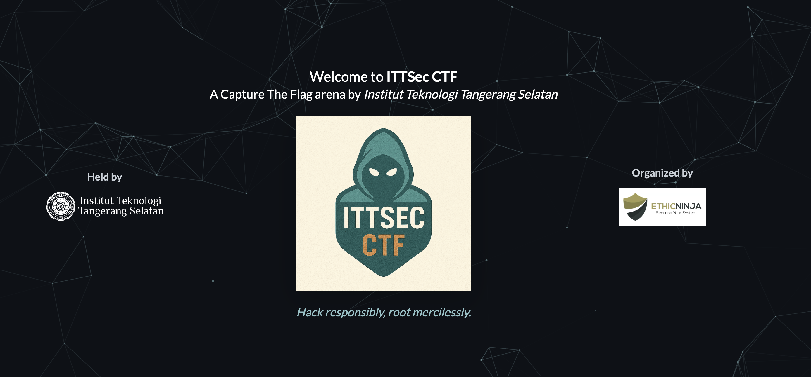
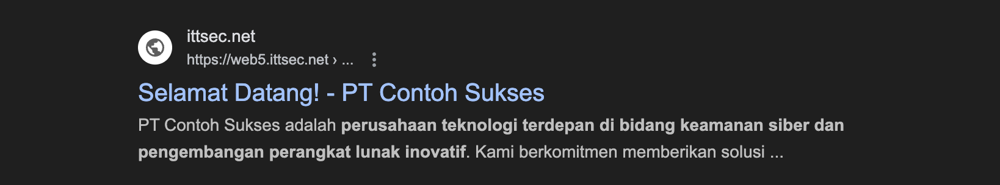
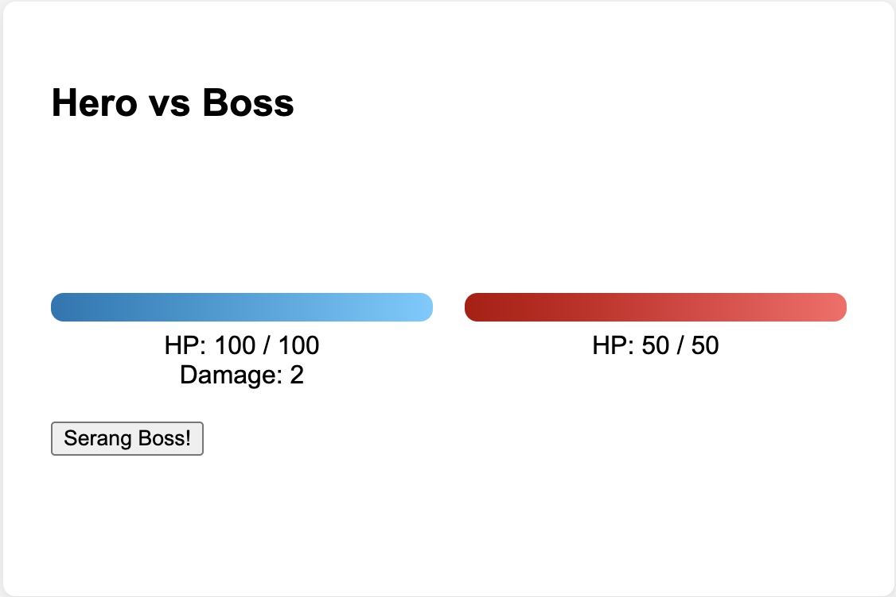
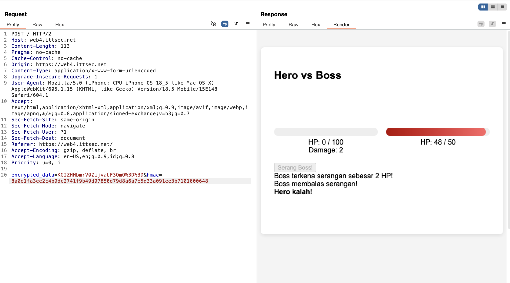
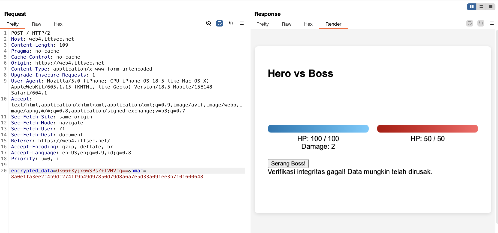
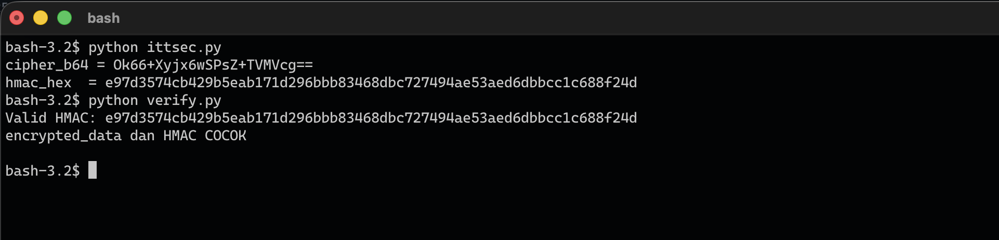
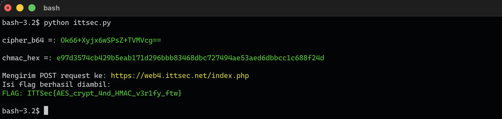

halo selamat pagi, siang dan malam.

saya lagi lihat postingan pak Onno W. Purbo di facebook 
tentang Pemenang lomba hacking ITTSec - CTF 2025



saya penasaran dengan lombanya, terutama dengan soal ctfnya.
ketika saya mengecek ternyata web lombanya sudah ditutup. 
padahal saya penasaran dengan soal ctfnya. 

yaudah kita recon tipis-tipis saja :D 

```google search ->  site:.ittsec.net```



Ternyata untuk soal CTFnya masih bisa diakses. 
list soal yang bisa di akses : 

```
web1.ittsec.net
web2.ittsec.net
web3.ittsec.net
web4.ittsec.net
web5.ittsec.net
web6.ittsec.net
web7.ittsec.net
```
dari sejumlah soal yang dapat di akses, saya penasaran dengan soal no 4. 

***Hero vs Boss - Web4 (AES + HMAC)***


sebenarnya soal ini mirip seperti pada soal no 2 dan 3. 
hanya saja pada title soal tersebut ada AES + HMAC
ketika mencoba mengklik button *serang boss* saya kalah. 

saya mencoba melakukan intercept pada Burp Suite untuk melihat param apa yang dikirim. 



terdapat 2 parameter yang dikirim yaitu : ```encrypted_data``` dan ```hmac```

```encrypted_data -> base64``` dan ```hmac -> SHA256-HEX```

tetapi ini bukan base64 yang normal, ini base64 yang telah di enkripsi berdasarkan kunci/key. 
ini seperti soal no 3 yang bisa dimanipulasi nilai parameternya melalui post method. hanya saja nilai/value-nya telah di enkripsi dengan key. 

bagaimana bisa mengetahuinya? terpadat file javascript ```https://web4.ittsec.net/js/crypto-utils.js```

```javascript
const getConstant = (idx) => {
    const c = [
        [77, 121, 83, 117, 112, 101, 114, 83, 101, 99, 114, 101, 116, 75, 51, 121],
        [73, 110, 105, 116, 105, 97, 108, 86, 101, 99, 116, 111, 114, 49, 50, 51]
    ];
    return String.fromCharCode(...c[idx]);
};

const AES_KEY = getConstant(0);
const AES_IV = getConstant(1);

async function encryptData(data) {
    try {
        const encoder = new TextEncoder();
        const keyData = encoder.encode(AES_KEY);
        const ivData = encoder.encode(AES_IV);

        const cryptoKey = await window.crypto.subtle.importKey(
            'raw',
            keyData,
            { name: 'AES-CBC', length: 128 },
            false,
            ['encrypt']
        );

        const encryptedBuffer = await window.crypto.subtle.encrypt(
            { name: 'AES-CBC', iv: ivData },
            cryptoKey,
            encoder.encode(data)
        );
        return btoa(String.fromCharCode.apply(null, new Uint8Array(encryptedBuffer)));
    } catch (error) {
        console.error("Encryption error:", error);
        return null;
    }
}

async function generateHmac(data) {
    try {
        const encoder = new TextEncoder();
        const keyData = encoder.encode(AES_KEY);

        const cryptoKey = await window.crypto.subtle.importKey(
            'raw',
            keyData,
            { name: 'HMAC', hash: 'SHA-256' },
            false,
            ['sign']
        );

        const signatureBuffer = await window.crypto.subtle.sign(
            'HMAC',
            cryptoKey,
            encoder.encode(data)
        );
        return Array.from(new Uint8Array(signatureBuffer)).map(b => b.toString(16).padStart(2, '0')).join('');
    } catch (error) {
        console.error("HMAC generation error:", error);
        return null;
    }
}
```

kalau dilihat dari kode enkripsi, terdapat 2 variable yaitu ```AES_KEY``` dan ```AES_IV```  

keduanya mengambil hasil dari variable ```getConstant``` yang dimana itu sepertinya adalah kunci/key enkripsinya. 

```javascript
const getConstant = (idx) => {
    const c = [
        [77, 121, 83, 117, 112, 101, 114, 83, 101, 99, 114, 101, 116, 75, 51, 121],
        [73, 110, 105, 116, 105, 97, 108, 86, 101, 99, 116, 111, 114, 49, 50, 51]
    ];
    return String.fromCharCode(...c[idx]);
};

const AES_KEY = getConstant(0);
const AES_IV = getConstant(1);
```

kode ini merupakan ```array``` 
```array
[77, 121, 83, 117, 112, 101, 114, 83, 101, 99, 114, 101, 116, 75, 51, 121],
[73, 110, 105, 116, 105, 97, 108, 86, 101, 99, 116, 111, 114, 49, 50, 51]
```
jadi kita tinggal mengembalikan nilai dari array tersebut menjadi plaintext yang bisa dibaca 
```python
c = [
    [77, 121, 83, 117, 112, 101, 114, 83, 101, 99, 114, 101, 116, 75, 51, 121],
    [73, 110, 105, 116, 105, 97, 108, 86, 101, 99, 116, 111, 114, 49, 50, 51]
]

def decode(idx):
    return ''.join(chr(x) for x in c[idx])

print(decode(0)) 
print(decode(1))
```

hasilnya : 
```
MySuperSecretK3y
InitialVector123
```
kita akan mencoba memverifikasi dengan key yang telah kita dapat, apakah itu kuncinya atau bukan.
```python
import hmac, hashlib

hmac_hex = "8a0e1fa3ee2c4b9dc2741f9b49d97850d79d8a6a7e5d33a091ee3b7101600648" # value dari param hmac
hmac_verify = bytes.fromhex(hmac_hex)

key = b'MySuperSecretK3y' # kunci - key
msg = b'KGIZHHbmrV0ZijvaUF3OmQ=='  # value dari param encrypted_data

calc = hmac.new(key, msg, hashlib.sha256).digest()

if hmac.compare_digest(calc, hmac_verify):
    print("Valid HMAC")
else:
    print("Invalid HMAC")
```
Hasilnya : ```Valid HMAC``` artinya itu adalah kunci key yang kita cari. 

sekarang kita mencoba mendekripsi isi dari param ```encrypted_data=``` yaitu ```KGIZHHbmrV0ZijvaUF3OmQ==``` dengan kunci yang telah kita ketahui
```python
from base64 import b64decode
from Crypto.Cipher import AES

AES_KEY = b"MySuperSecretK3y"
AES_IV  = b"InitialVector123"

def unpad_pkcs7(data: bytes) -> bytes:
    pad_len = data[-1]
    if pad_len < 1 or pad_len > AES.block_size:
        raise ValueError("Invalid padding")
    if data[-pad_len:] != bytes([pad_len]) * pad_len:
        raise ValueError("Invalid padding")
    return data[:-pad_len]

def decrypt_base64_aes_cbc(b64_ciphertext: str) -> str:
    ct = b64decode(b64_ciphertext)
    cipher = AES.new(AES_KEY, AES.MODE_CBC, AES_IV)
    pt_padded = cipher.decrypt(ct)
    pt = unpad_pkcs7(pt_padded)
    return pt.decode('utf-8')

if __name__ == "__main__":
    ciphertext = "KGIZHHbmrV0ZijvaUF3OmQ==" # value dari param encrypted_data
    try:
        plaintext = decrypt_base64_aes_cbc(ciphertext)
        print("Decrypted:", plaintext)
    except Exception as e:
        print("Decryption error:", e)
```

Hasilnya : ```Decrypted: damage=2```

untuk menyelesaikan tantangan ini kita diharuskan melakukan manipulasi nilai/value untuk bisa menang atau menyerang boss. 
pada tahap ini kita telah berhasil melihat nilai/value apa yang dikirim agar kita bisa melakukan manipulasi untuk menyerang boss. 
jika kita menaikan damagenya menjadi 100 sepertinya kita bisa meyelesaikan game ini dengan cepat. 

langkah selanjutnya kita tinggal mengganti damagenya menjadi 100 ```damage=100``` dan mengenkripsi kembali kedalam base64 dengan enkripsi dari javacript yang telah kita dapat sebelumnya. 
```python
from base64 import b64encode
from Crypto.Cipher import AES

AES_KEY = b"MySuperSecretK3y"
AES_IV  = b"InitialVector123"

def pad_pkcs7(data: bytes) -> bytes:
    pad_len = AES.block_size - (len(data) % AES.block_size)
    return data + bytes([pad_len]) * pad_len

def encrypt_to_base64_aes_cbc(plaintext: str) -> str:
    pt = plaintext.encode('utf-8')
    pt_padded = pad_pkcs7(pt)
    cipher = AES.new(AES_KEY, AES.MODE_CBC, AES_IV)
    ct = cipher.encrypt(pt_padded)
    return b64encode(ct).decode('utf-8')

if __name__ == "__main__":
    plaintext = "damage=100" # encrypted_data
    ciphertext_b64 = encrypt_to_base64_aes_cbc(plaintext)
    print(ciphertext_b64)
```

Hasilnya : ```Ok66+Xyjx6wSPsZ+TVMVcg==```

kita melakukan request kembali apakah berhasil mendapatkan flagnya? 



Ternyata gagal, apakah karena hmacnya tidak sama? kita perlu memastikan jika hmacnya valid atau tidak.
```python
import hmac, hashlib

hmac_hex = "8a0e1fa3ee2c4b9dc2741f9b49d97850d79d8a6a7e5d33a091ee3b7101600648" # value dari param hmac sebelumnya dengan encrypted_data: GIZHHbmrV0ZijvaUF3OmQ==
hmac_verify = bytes.fromhex(hmac_hex)

key = b'MySuperSecretK3y' # kunci - key
msg = b'Ok66+Xyjx6wSPsZ+TVMVcg=='  # value dari param encrypted_data yang telah kita enkripsi dengan kunci yaitu : damage=100

calc = hmac.new(key, msg, hashlib.sha256).digest()

if hmac.compare_digest(calc, hmac_verify):
    print("Valid HMAC")
else:
    print("Invalid HMAC")
```

Hasilnya : ```Invalid HMAC```

Berarti bisa dilihat bahwa hmacnya memang berbedah atau hmacnya harus cocok dengan encrypted_data. jadi ketika kita melakukan enkripsi pada encrypted_data harus sekaligus dengan hmacnya
```python
from base64 import b64encode
import hmac, hashlib
from Crypto.Cipher import AES

AES_KEY = b"MySuperSecretK3y"
AES_IV  = b"InitialVector123"

def pad_pkcs7(data: bytes) -> bytes:
    pad_len = AES.block_size - (len(data) % AES.block_size)
    return data + bytes([pad_len]) * pad_len

def encrypt_to_base64_aes_cbc(plaintext: str) -> str:
    pt_padded = pad_pkcs7(plaintext.encode('utf-8'))
    cipher = AES.new(AES_KEY, AES.MODE_CBC, AES_IV)
    ct = cipher.encrypt(pt_padded)
    return b64encode(ct).decode('utf-8')

def hmac_sha256_hex(key: bytes, message: bytes) -> str:
    return hmac.new(key, message, hashlib.sha256).hexdigest()

plaintext = "damage=100" # manipulasi value dari param encrypted_data
cipher_b64 = encrypt_to_base64_aes_cbc(plaintext)
hmac_hex = hmac_sha256_hex(AES_KEY, cipher_b64.encode('utf-8'))

print("cipher_b64 =", cipher_b64)
print("hmac_hex  =", hmac_hex)
```

hasilnya : 
```
cipher_b64 = Ok66+Xyjx6wSPsZ+TVMVcg==
hmac_hex  = e97d3574cb429b5eab171d296bbb83468dbc727494ae53aed6dbbcc1c688f24d
```

Sekarang kita mengecek apakah enksirpsi base64 dan hmacnya cocok atau tidak. 
```python
import hmac, hashlib

hmac_hex = "e97d3574cb429b5eab171d296bbb83468dbc727494ae53aed6dbbcc1c688f24d" # value dari param hmac 
hmac_verify = bytes.fromhex(hmac_hex)

key = b'MySuperSecretK3y' # kunci - key
msg = b'Ok66+Xyjx6wSPsZ+TVMVcg=='  # value dari param palintext encrypted_data : damage=100

calc = hmac.new(key, msg, hashlib.sha256).digest()

if hmac.compare_digest(calc, hmac_verify):
    print(f"Valid HMAC: {hmac_hex}")
    print("encrypted_data dan HMAC COCOK")
    print(f"")
else:
    print(f"Invalid HMAC: {hmac_hex}")
```
hasilnya : 



Sekarang kita bisa menyelesaikan game ini dan mendapatkan flagnya : 
```python
from base64 import b64encode
import hmac, hashlib
from Crypto.Cipher import AES
import requests
from bs4 import BeautifulSoup
from colorama import Fore, Style, init 

# Inisialisasi colorama (penting untuk kompatibilitas di Windows)
init(autoreset=True)

AES_KEY = b"MySuperSecretK3y"
AES_IV  = b"InitialVector123"

def pad_pkcs7(data: bytes) -> bytes:
    pad_len = AES.block_size - (len(data) % AES.block_size)
    return data + bytes([pad_len]) * pad_len

def encrypt_to_base64_aes_cbc(plaintext: str) -> str:
    pt_padded = pad_pkcs7(plaintext.encode('utf-8'))
    cipher = AES.new(AES_KEY, AES.MODE_CBC, AES_IV)
    ct = cipher.encrypt(pt_padded)
    return b64encode(ct).decode('utf-8')

def hmac_sha256_hex(key: bytes, message: bytes) -> str:
    return hmac.new(key, message, hashlib.sha256).hexdigest()

plaintext = "damage=100"
cipher_b64 = encrypt_to_base64_aes_cbc(plaintext)
hmac_hex = hmac_sha256_hex(AES_KEY, cipher_b64.encode('utf-8'))

print(f"\ncipher_b64 =: {Fore.GREEN}{cipher_b64}{Style.RESET_ALL}")
print(f"\nchmac_hex =: {Fore.GREEN}{hmac_hex}{Style.RESET_ALL}")

# --- BAGIAN UNTUK POST REQUEST ---

url = "https://web4.ittsec.net/index.php"
encoded_cipher = cipher_b64
payload = {
    'encrypted_data': encoded_cipher,
    'hmac': hmac_hex
}

try:
    print(f"\nMengirim POST request ke: {Fore.YELLOW}{url}{Style.RESET_ALL}")
    response = requests.post(url, data=payload)

    if response.status_code == 200:
        soup = BeautifulSoup(response.text, 'html.parser')
        flag_div = soup.find('div', id='flag')
        
        if flag_div:
            flag_content = flag_div.text.strip()
            print("Isi flag berhasil diambil:")

            print(f"{Fore.GREEN}{flag_content}{Style.RESET_ALL}")
            print("")
        else:
            print("Elemen <div id=\"flag\"> tidak ditemukan di respons server.")
            print("Respons Server:", response.text)
    else:
        print("Request gagal dengan Status Code:", response.status_code)
        print("Respons Server:", response.text)

except requests.exceptions.RequestException as e:
    print("Request gagal:", e)

```



# FLAG : ITTSec{AES_crypt_4nd_HMAC_v3r1fy_ftw}


